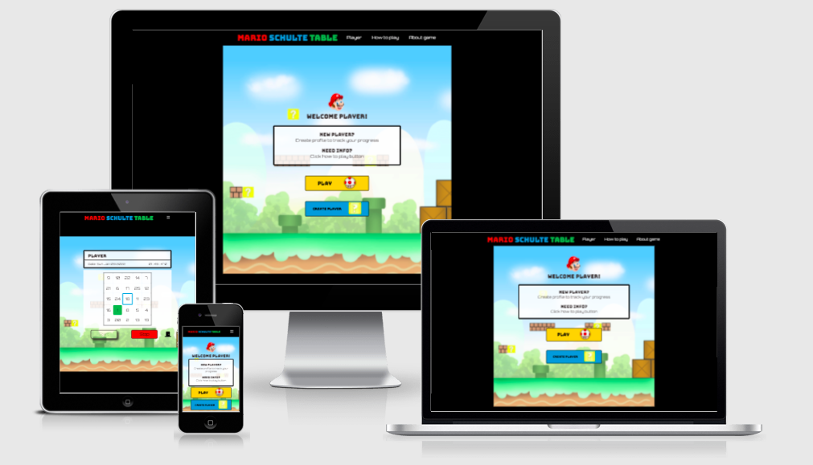
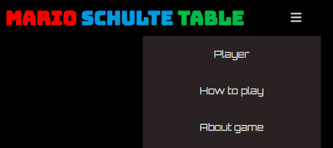
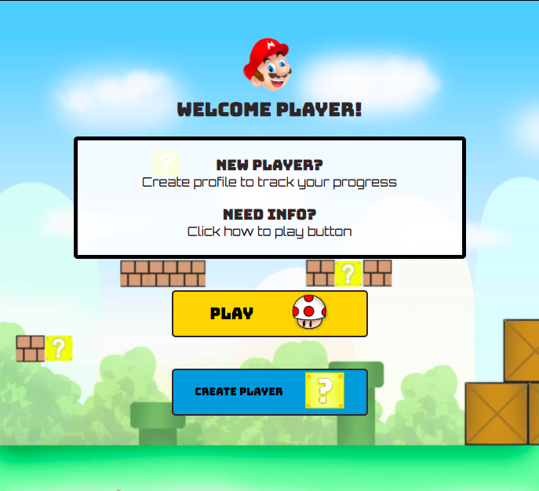
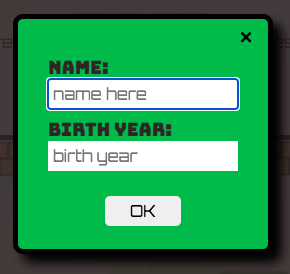
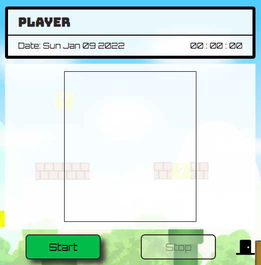
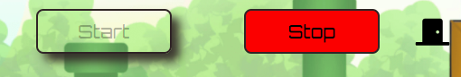
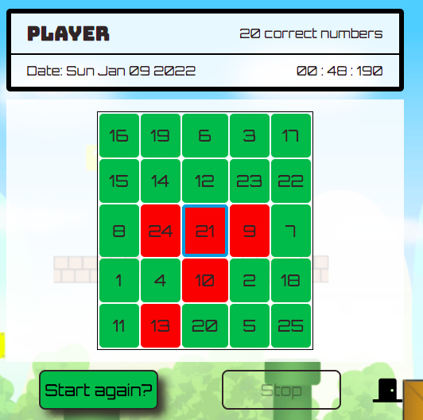
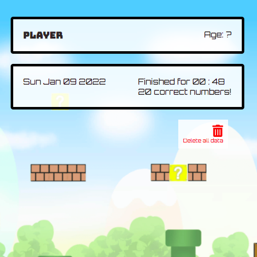

# [Mario Schulte Table](https://anamelisago.github.io/portfolio-2-mario-schulte-table/)

 
## Table of Contents:
* [What does it do and what does it need to fulfill?](#what-does-it-do-and-what-does-it-need-to-fulfill)
* [Functionality of Project](#functionality-of-project)
* [User Experience](#user-experience)
   * [User Stories](#user-stories)
   * [Design](#design)
       * [1. Font](#1-font)
       * [2. Color Scheme](#2-color-scheme)
       * [3. Logo](#3-logo)
       * [4. Geometry](#4-geometry)
       * [5. Wireframing](#5-wireframing)
* [Technology Used](#technology-used)
* [Database](#database)
* [Features](#features)
   * [Future Features](#future-features)
* [Testing](#testing)
   * [Defensive Design](#defensive-design)
* [Deployment](#deployment)
* [Credits](#credits)
   * [Special Thanks & Acknowledgements](#special-thanks--acknowledgements)
 
***
 
## Welcome to Mario Schulte Table!
 

 
***
 
## What does it do and what does it need to fulfill?

Mario Schulte Table is a gaming website for brain training. It is mainly used to upgrade the user's reading skills to a higher level. Exercises with schulte tables is very benefitial to any users which improves peripheral visual perception that can be useful on a daily basis, most importantly in aiming speed reading. For younger users it can be very useful in learning the proper sequence of numbers or the alphabet.

The very goal of the game is not to get a high score nor to finish it in the least amount of time. It's aimed to widen the peripheral vision concentrating the eye in one single spot in the table. Just keeping the eye in the center of the table without moving it away from that spot and search for the numbers in ascending order, starting from 1 up to the last number which is the number 25.

### Favicon
This is the favicon used in this project.

 
### Functionality of Project

To play games while training the brain to maintain it in good working condition. It is also for speed reading, training the eye using peripheral vision when searching objects or reading texts, to add the player's name and age to be able to track the user's progress.

[Back to top](#table-of-contents)
 
## User Experience:
 
#### User Stories:
_Generic (Guest/Public) User:_
* As a Generic User, I want to...
   * use applications for every age and gender.
   * train the brain by playing.
   * be guided how to navigate the website.
   * to be given some instructions how to play the game for the first time.

 
_Registers (Logged in) User:_
* As a Registered User, I want to...
   * improve reading skills and concentration everyday.
   * continuously train the eye peripheral vision.
   * be able to view daily achievements to see one's improvement.
   * increase level to gain a better outcome.
 
_Developer:_
* As a Developer, I want to...
   * learn to code using different languages.
   * test my ability of problem solving.
   * be able to build a very useful and attractive app for all users boosting my creativity and resourcefulness.

[Back to Top](#table-of-contents)

#### Design
 
##### 1. Font
The font used in the website is from Google fonts:
   * __Bungee__ for the headings.
   * __Orbitron__ for the rest of the text to give it some vintage gaming vibes 

 
##### 2. Color Scheme
Basic colors are chosen for the website color scheme following the Super Mario game style: red, blue, green, yellow, black, and white.
 

 
##### 3. Logo

   

The chosen logo for this project is the main character from the Super Mario games, Mario himself. I added some more icon logos for the buttons of the main page of the game: [the mystery box](assets/images/question-block.png) and the [Super mushroom](assets/images/super-mashroom.png), which is the favicon used in this project. I used digital illustration app to make all the logos.

##### 4. Geometry
 
The main purpose of the game is to force the eye to concentrate in one spot, which is the center of the table, so the game table has to stay at the center of the screen to focus the eye so the user doesn't get distracted by the background or any other element of the page.

The background is from the Super Mario main setting. It wraps the whole table but is not stretched out to maintain the purpose of the game. It’s illustrated using a digital illustration app, MediBang, and the colors are softened up a bit so that it doesn’t come into conflict with the foreground elements. 

 
##### 5. Wireframing
 
Bringing plans come into life using Balsamiq Wireframes.

The homepage

The schulte table

[Back to Top](#table-of-contents)
 
## Technology Used
 
### Languages, Libraries, Frameworks, Editors & Version Control:

* Tech stack used
   * __[HTML](https://developer.mozilla.org/en-US/docs/Web/HTML) (HyperText Markup Language)__ for the basic structure and content of the website.

   * __[CSS](https://developer.mozilla.org/en-US/docs/Web/CSS) (Cascading Style Sheet)__ for styling the elements of the website.

   * __[JavaScript](https://developer.mozilla.org/en-US/docs/Web/JavaScript)__ for interactivity of the website.

* Version control
   - **GIT** for version control.

   - __[GITHUB](https://github.com)__ to store the project and for deployment.

* Editor

   - __[Gitpod](https://gitpod.com)__ is used as the editor for this project.

* Libraries and frameworks

   - [FontAwesome](https://fontawesome.com/v5.15/icons/bars?style=solid) for the icons used through out the website.

   - [GoogleFonts](https://fonts.google.com/) used to style the texts of this project.

### Tools Used:

* __Balsamiq Wireframes__ to make the wireframes.

* __[MediBang Paint](https://medibangpaint.com/en/)__ is used for digital illustrations for this project. I created the background and all the logos using this application.

[Back to Top](#table-of-contents)
 
## Features
 
The project boasts several key features:

### The header

* Heading

The heading is the title of the game. I chose it as the home button to make it simpler.

* The Navigation bar

When the screen gets smaller the navbar shrink into an icon, and they appear when the icon is clicked. It includes the player's info, instructions on how to play the game and a small explanation about the game for first time users.

### Home page

The player is welcome just as the page is loaded. Some guides are displayed for new users. Two buttons are shown, one for the gaming table section and the other one is to create a player's profile to be shown in the webpage afterwards.

* Create a player form

The form is very simple and short. To create a player's profile, a name and the birth year of the player needs to be provided. That data is stored in the local storage.

### The Schulte table

The player's name is shown on top, and just below it are the current date, and the timer.

* The buttons

There are three buttons below the table: the start button, the stop button, which is disabled to prevent accidental clicks and an exit button to go to the homepage. Can also click the heading from the header to go to the homepage and exit the game, but it is easier and intuitive to put an icon to exit game especially for first time user.

The start button is disabled once the game starts with the same purpose, to prevent accidental clicks which can create bugs in the script. On the contrary, the stop button is enabled to stop the game anytime the user wants.

* End game

Once the game ends, the timer stops, a recount of how many correct number sequence are clicked and the start button is clickable again to start playing once again.

### Player's info

The player's name and age are displayed on top of the page.

The box under it are the data from the last game result. It shows the date, how long did the player finished the game and the total correct numbers.

An icon is added below the two boxes. It is used to delete all the data stored in the local storage to create a new player afterwards.
 
[Back to Top](#table-of-contents)
 
#### Future Features:
 
* Be able to store more players and view improvement in daily and weekly chart.
* To set the table cells according to age. Less table for kids and more table cells for adults.
* Be able to add game levels and increase difficulty to test user skill and the ability to concentrate.
* Be able to set score according to the right clicked numbers.

 
## Testing
 
The W3C Markup Validator, W3C CSS Validator and JShint JavaScript Validator was used to test and validate the webpage to make sure there are no errors or bugs.

    

Manual testing was constantly carried out during the development of the webpage. Used the developers tools to see if there's some error in the code and styles. 

Deployed and tested if the game is working and fully functional.

Tested on different devices to see how the game works. 

Tested the game table if all functions are executing well. Timer goes well during game time. Retrieving data from the local storage to be used inside the webpage is working fine.

Tested theLighthouse Accessibility performance. Below is the result.

[Back to Top](#table-of-contents)
 
#### Found Bugs and Fixes:
 
During manual testing, I found out that when the stop button was clicked, the game didn’t reset. Had to add a function to reset data from the start.

When I tried to set up the input form from index.html, there was a conflict in JavaScript. It couldn’t execute the rest of the codes from the script file for table.html and the index.html. I had to join the table file and the index file to make the script execute. I managed to make it work using event listeners. When a button is clicked a section is shown and the other is hidden. 

The player's name is shown in different part of the page: in the navbar, in the home page, in the player's info section and above the game table. But during the first execution I found a bug when trying to access the player’s data. I manage to make the name of the player show in different parts of the page by using loop in the class name, and then assigning the value of the player's name from the local storage.

When the game has started, the timer doesn't stop when accidentally clicked the start button and even though the stop button is clicked the timer keeps on going. I managed to fix it by adding a disable attribute to the button that is not needed during play time, and vice versa.

When tested the script through JShint, there was a warning about a function declared inside a for loop referencing an outer scope can lead to consfusing semantics. It's a function inside the filter method. I check it with my mentor. I managed to get rid of the warning by not using the variable outside the bracket.

When I tried the game and selected incorrect number sequence first, the script got stuck during the splice method which makes all clicked numbers wrong even though the sequence is correct afterwards. I managed to make it right by changing the the code in the splice method. Instead of inserting the index number, it should insert the number currently clicked.

[Back to Top](#table-of-contents)
 
#### Defensive Design
 
The design of the website has a touch of vintage gaming vibes to attract users especially those who are into vintage games.

The first thing that is loaded in the site is a guide for first time players. It's short and easy to read.

The instructions and game information is accesible from the home section and from the game table section. Included inside the instructions are recomendations for the user for better results.

The form to create a player's profile is short, simple and intuitive, with placeholders to guide the user. Once opened the form, it's directly focused on the first input field, so that the user can easily type the required data. The birth year input area only accepts numbers. Both input fields require data before submitting form.

All files are named according to their purpose. The code is labeled for easy access, and well indented for readability. All functions in the script are documented using docstrings for future maintainability and debugging.

All images use alt text in case they don't load.

The player's info section displays the last game result, with the date when it was played. They are all stored in the local storage but can be deleted using a button provided for the user.

Overall, the design is simple, easy to navigate and with a touch of vintage gaming vibes.

 
## Deployment
 
This project is deployed in GitHub. Below are the steps on how to deploy a repository.

1. From the main page of the repository, select `Settings` in the menu bar just below the project’s name. 
2. Within Settings, scroll down from the left hand side menu bar. Click `Page`.
3. In the source section, change none to `main` from the dropdown branch options and click `Save`.
4. A message prompts just above it, announcing your site is ready to be published.
5. Wait for a few seconds, and refresh the page.
6. The message will change with a check mark stating the site is published. A link is provided to view the webpage.

 
[Back to Top](#table-of-contents)
 
## Credits

### Code
* dcode Tutorials: for some knowledge in setting up buttons and [how to use the local storage](https://youtu.be/k8yJCeuP6I8).
* [JavaScript Academy Tutorial](https://www.youtube.com/watch?v=OjQP7rPwJyE&t=334s) for the responsive navigation bar.
* [Css tricks](https://css-tricks.com/snippets/css/a-guide-to-flexbox/) for a complete guide of flexbox.
* Kevin Powell - for the video tips.
* [Anton Kalinin Codepen](https://codepen.io/ssh) - for some guides in building this project.
* Geeks for Geeks: [Javascript code to shuffle an array of numbers](https://www.geeksforgeeks.org/how-to-shuffle-an-array-using-javascript/), [add focus method to input form](https://www.geeksforgeeks.org/set-the-focus-to-html-form-element-using-javascript/)
* Jonas Schmetdmann (Udemy) - for teaching Javascript.
* Team 11 WishTree Holiday Hackathon - for some guides they provided during December Hackathon.
* MDN WebDocs
* W3schools
* Stackoverflow
* [Better Dev](https://www.better.dev/javascript-array-filter-method) for the filter method of array guide.
* [Walter Nascimento](https://dev.to/walternascimentobarroso/creating-a-timer-with-javascript-8b7) for the timer tutorial from dev.to website.
* [Code grepper](https://www.codegrepper.com/code-examples/javascript/remove+button+disabled+js) for the disabled attribute guide.
* [Web Dev Simplified](https://youtu.be/MBaw_6cPmAw) for the video tutorial how to create a modal.

### Content
* Speed Reading app
* Librain: Schulte Table - for the idea

### Media

* All the images used as icons and background are my own illustrations created from MediBang paint based on the Super Mario games.

[Back to Top](#table-of-contents)
 
#### Special Thanks & Acknowledgements:
 
* To all the members of Team 11 🤜 (Marina, Anthony, Chris and Debbie) December Hackathon.
* My mentor.
* To all the tutors and the Slack Community for some guidance.
* To my family and friends, and most of all my daughter, Sophia, my inspiration.

 
###### <i>Disclaimer: This project was created for educational use only as part of my Portfolio Project 2</i>
 
[Back to Top](#table-of-contents)

