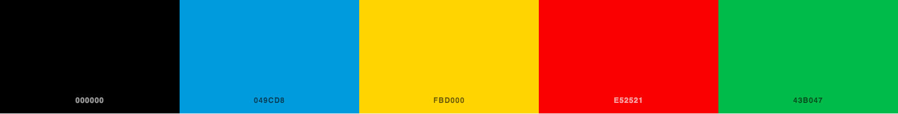
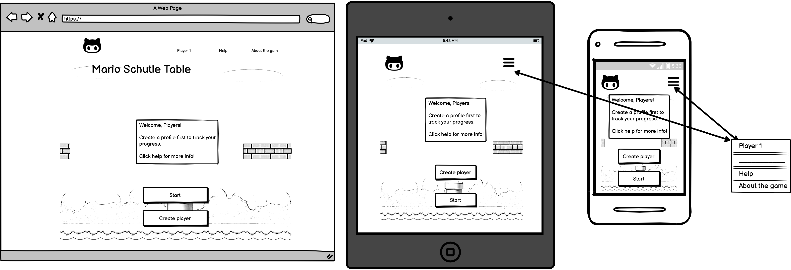
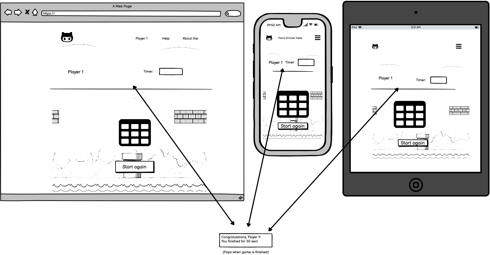

# Mario Schulte Table
***
 
## Table of Contents:
* [What does it do and what does it need to fulfill?](#what-does-it-do-and-what-does-it-need-to-fulfill)
* [Functionality of Project](#functionality-of-project)
* [User Experience](#user-experience)
   * [User Stories](#user-stories)
   * [Design](#design)
       * [1. Font](#1-font)
       * [2. Color Scheme](#2-color-scheme)
       * [3. Logo](#3-logo)
       * [4. Geometry](#4-geometry)
       * [5. Wireframing](#5-wireframing)
* [Technology Used](#technology-used)
* [Database](#database)
* [Features](#features)
   * [Future Features](#future-features)
* [Testing](#testing)
   * [Defensive Design](#defensive-design)
* [Deployment](#deployment)
* [Credits](#credits)
   * [Special Thanks & Acknowledgements](#special-thanks--acknowledgements)
 
***
 
## Welcome to Mario Schulte Table!
 

 
***
 
## What does it do and what does it need to fulfill?

Mario Schulte Table is a game website to train the brain. It is mainly used to upgrade the user's reading skills to a higher level. Exercises with schulte tables is very benefitial to improve peripheral visual perception that can be useful on a daily basis, most importantly in aiming speed reading.

### Favicon
This is the favicon used in this project.

 
### Functionality of Project

The goal of the game is not to get a high score nor to finish it in the least amount of time. It's aimed to widen the peripheral vision concentrating the eye in one single spot in the table. Just in the center of the table without moving the eye away from that spot.

[Back to top](#table-of-contents)
 
## User Experience:
 
#### User Stories:
_Generic (Guest/Public) User:_
* As a Generic User, I want to...
   * use applications for every age and gender.
   * train the brain by playing.
   * be guided how to navigate website.
   * to be given some instructions how to play the game

 
_Registers (Logged in) User:_
* As a Registered User, I want to...
   * to improve reading skills and concentration everyday
   * to continuously train the eye peripheral vision
   * be able to view daily achievements to see one's improvement
   * to increase level to gain a better outcome
 
_Developer:_
* As a Developer, I want to...
   * learn to code using different languages.
   * test my ability of problem solving.
   * be able to build a very useful and attractive app for all users boosting my creativity and resourcefulness.

[Back to Top](#table-of-contents)

#### Design
 
##### 1. Font
The font used in the website is from Google fonts:
   * __Bungee__ for the heading
   * __Orbitron__ for the rest of the text to give it some vintage gaming vibes 

 
##### 2. Color Scheme
Basic colors are chosen for the website color scheme following the colors from the Super Mario games: red, blue, green, yellow, white and black.
 

 
##### 3. Logo

The chosen logo for this project is the main character from the Super Mario game, Mario himself. I added some more icon logos for the buttons of the main page of the game: the mystery box and the Super mushroom. I used digital illustration app to make all the logos.

I chose the main heading of the game as the home button to make it simpler.
 

##### 4. Geometry
 
The main purpose of the game is to force the eye to concentrate in one spot, which is the center of the table, so the game table has to stay at the center of the screen to focus the eye so the user doesn't get distracted by the background or any other element of the page.

The background is from the Super Mario main setting. It wraps the whole table but is not stretched out to maintain the purpose of the game. It’s illustrated using a digital application software, MediBang, and the colors are softened up a bit so that it doesn’t come into conflict with the foreground elements. 

 
##### 5. Wireframing
 
Bringing plans come into life using Balsamiq Wireframes.

The homepage

The schulte table

[Back to Top](#table-of-contents)
 
## Technology Used
 
### Languages, Libraries, Frameworks, Editors & Version Control:

* Tech stack used
   * __[HTML](https://developer.mozilla.org/en-US/docs/Web/HTML) (HyperText Markup Language)__ for the basic structure and content for building a website.

   * __[CSS](https://developer.mozilla.org/en-US/docs/Web/CSS) (Cascading Style Sheet)__ for styling the elements of the website.

   * __[JavaScript](https://developer.mozilla.org/en-US/docs/Web/JavaScript)__ for interactivity of the website.

* Version control
   - **GIT** for version control.

   - [GITHUB](https://github.com) to store the project.

* Editor

   - [Gitpod](https://gitpod.com) is used as the editor for this project.

* Libraries and frameworks

   - [FontAwesome](https://fontawesome.com/v5.15/icons/bars?style=solid) for the icon used in the navbar.

   - [GoogleFonts](https://fonts.google.com/) used to style the texts of this project.

### Tools Used:

* __Balsamiq Wireframes__ to make the wireframes of this project.

* __[MediBang Paint](https://medibangpaint.com/en/)__ is used for digital illustration of this project. I created the background and all the logos using this application.

[Back to Top](#table-of-contents)
 
## Features
 
The project boasts several key features:
* Create: ...
 
[Back to Top](#table-of-contents)
 
#### Future Features:
 
* Detail future implementations here...
 
## Testing
 
The W3C Markup Validator, W3C CSS Validator and Jigsaw JavaScript Validator was used to test and validate the webpage to make sure there are no errors or bugs.
<!-- need more proof like screen shots etc-->

Manual testing was constantly carried out during the development of the webpage. Used the developers tools to see if there's some error in the code and styles. 

Deployed and tested if the game is working and fully functional.

Tested on different devices to see how the game works. 

Tested the game table if all functions are executing well. Timer goes well during game time. Retrieving data from the local storage to be used inside the webpage is working fine.

Tested theLighthouse Accessibility performance. Below is the result.

 
#### Found Bugs and Fixes:
 
During manual testing, I found out that when the stop button was clicked, the game didn’t reset. Had to add a function to reset data from the start.

When I tried to set up the input form from index.html, there was a conflict in JavaScript. It couldn’t execute the rest of the codes from the script file for table.html and the index.html. I had to include the table section into the index file to make the script execute. I managed to make it work using event listeners. When a button is clicked a section is shown and the other is hidden. 

The player name is shown in different part of the page: in the navbar, in the home page and above the game table. But during execution I found a bug when trying to access the player’s data. I manage to make the name of the player show in different parts of the page by using the for loop and then assigning the value of player data from the local storage.

When the game has started, the timer doesn't stop when accidentally clicked the start button and though the stop button is clicked the timer keeps on going. I managed to fix it by adding a disable attribute to the button that is not needed during play time

 
[Back to Top](#table-of-contents)
 
#### Defensive Design
 
The first thing that is loaded in the site is a guide for first time players.

The fom to create a player's profile is short, simple and intuitive, with placeholders for the user. The birth year input area only accepts numbers. 

All files are named according to their purpose. The code is labeled for easy access and well indented for readability. All functions in the script are documented using docstrings for future maintainability and debugging.

Images use alt text in case they don't load. Tested and deployed.

Overall, the design is simple, easy to navigate and with a touch of vintage gaming vibes to attract more users.

 
## Deployment
 
Detail deployment here...
 
[Back to Top](#table-of-contents)
 
## Credits
 
* Detail credits
 
[Back to Top](#table-of-contents)
 
#### Special Thanks & Acknowledgements:
 
* Team 11 🤜
 
###### <i>Disclaimer: This project was created for educational use only as part of Portfolio Project 2</i>
 
[Back to Top](#table-of-contents)

